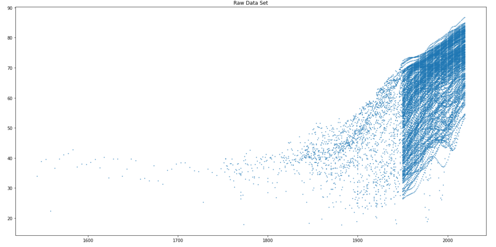
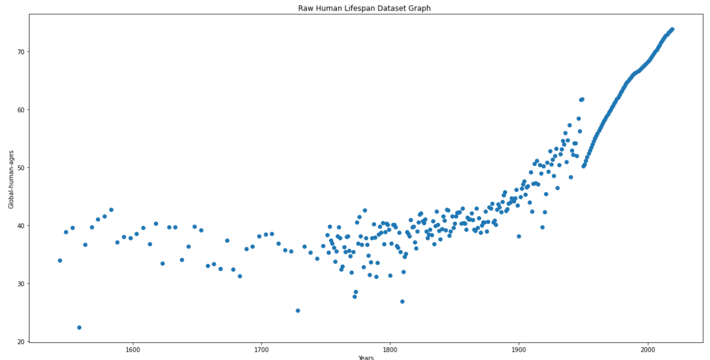
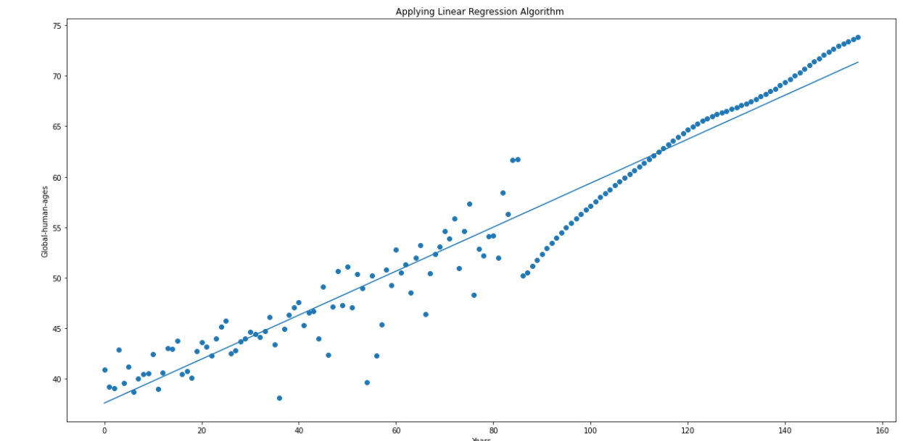
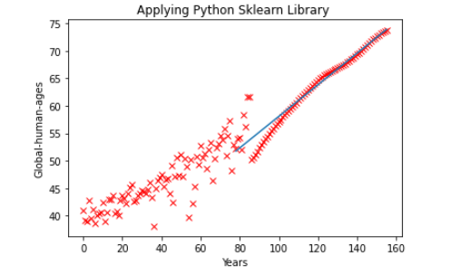

# Machine_Learning_Life_Projet
# Title: Machine Learning Life Project
### I worked on this by myself, I used Jypter Notebook and code this in Python.  

## View My Project Paper: 
1. 
2. 
3. 

## My Objective: 
### For this project I chose to do linear regression of life expectancy by country. In this project, I used a life expectancy data set with data from countries from around the world. we use linear regression to predict the age of death world-wide and by country in the years after the dataset. In this experiment, I get the dataset from the website https://ourworldindata.org/life-expectancy

## Sceenshot:

## What did I learned:

## What I would improved:
1. 
2. 
3. 

## Key feature:
1. 
2. 
3.
